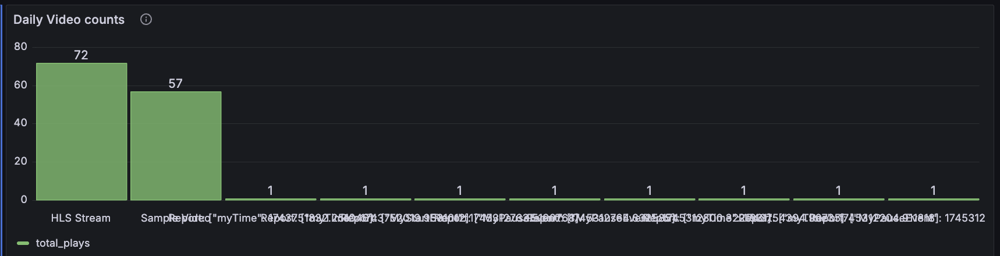
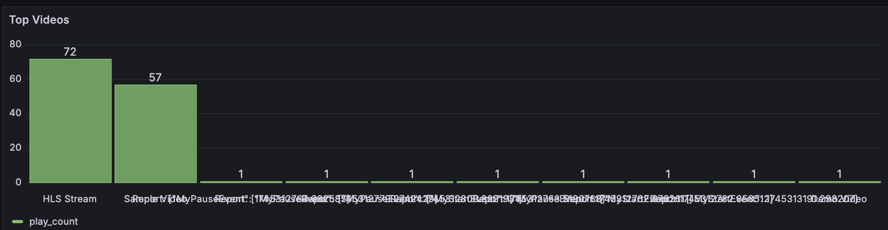
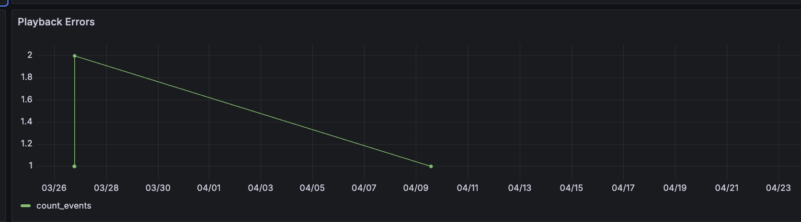

# Grafana and ClickHouse Integration for Analytics Pipeline

## Architecture Overview

The complete analytics pipeline consists of the following components:

```
[Video Player/Client] → [Eyevinn SDK] → [OSC ClickHouse DB] → [Grafana]
```

This guide focuses on setting up the visualization layer (Grafana) that connects to your ClickHouse database, allowing you to build dashboards for analyzing playback sessions and events.

## Prerequisites

Before starting, you need:
- A running ClickHouse instance with event data
- Your ClickHouse connection details:
   - Endpoint URL
   - Database name (typically `epas_default`)
   - Username and password

## Step 1: Provision a ClickHouse Server on Eyevinn OSC

If you haven't yet created a ClickHouse instance in Eyevinn's Open Source Cloud, follow the quick start in the Eyevinn OSC docs:
[Service: ClickHouse – Getting Started](https://docs.osaas.io/osaas.wiki/Service%3A-ClickHouse.html)

1. **Sign up** for a free Eyevinn OSC account (if you don't already have one).
2. **Setup secrets**
   - In the OSC web UI, create a **service secret** to hold the password for the default ClickHouse user.
3. **Create your server instance**
   - Click **Create clickhouse-server**, fill in the dialog (name, region, node size, attach your secret), then hit **Create**.
   - Wait until the status reads **Running**.
4. **Grab your connection details**
   - Copy the server's endpoint URL, default database name, and the credentials you stored in your secret.

With ClickHouse endpoint, database, username and password on hand, you're ready to move on.

## Step 2: Create a Grafana Instance

You have two options for running Grafana:

### Option A: Provision Grafana on Eyevinn OSC (Recommended)

1. **Create the admin password secret**
   - In OSC UI → Web Services → Service Secrets → New Secret
   - Name: `grafana` (or your preferred name)
   - Value: Your desired password
   - Click "Create Secret"
   - 

2. **Launch Grafana**
   - Go to OSC UI → Web Services → Grafana → Create Grafana
   - Set name: `grafana` (or your preferred name)
   - Plugins to Preinstall: `vertamedia-clickhouse-datasource`
   - Attach the secret you created
   - Click "Create" and wait for status to change to "running"
   - 
   - 


3. **Bind your secret to the instance**
   - Go to "My grafanas" → find your instance → "⋮" → Instance parameters
   - Select your admin password secret → Save

4. **Log in to Grafana**
   - Open the provided URL
   - Username: `admin`
   - Password: (the value set in your secret)
   - https://github.com/user-attachments/assets/de9a6f29-d3a8-4e13-94e3-e326d84c07c0

### Option B: Run Grafana Locally with Docker

1. **Pull and run the Grafana container**
   ```bash
   docker run -d \
     -p 3000:3000 \
     --name=grafana \
     grafana/grafana:latest
   ```

2. **Access Grafana**
   - Open browser at http://localhost:3000
   - Default credentials:
      - Username: `admin`
      - Password: `admin`
   - Set a new password when prompted

3. **Install the ClickHouse Plugin**
   - Go to Settings (⚙️) → Plugins
   - Search for "ClickHouse"
   - Select and click "Install" → "Enable"
   - Restart Grafana if prompted:
     ```bash
     docker restart grafana
     ```

## Step 3: Connect Grafana to ClickHouse

1. **Add ClickHouse as a data source**
   - In the left menu, go to Configuration (⚙️) → Data Sources → Add data source
   - Choose "ClickHouse" (or "Altinity plugin for ClickHouse" if using OSC)
   - 
   - Enter your connection details:
      - URL: `https://<your-clickhouse-endpoint>/play`
      - Default database: Your database name (typically `epas_default`)
      - Basic Auth: Enable
      - User: Your ClickHouse username
      - Password: Your ClickHouse password
   - Click "Save & Test" - you should see "Data source is working"

## Step 4: Create Analytics Dashboards

### Option A: Import the Sample Dashboard (Quickest)

1. In Grafana's sidebar click "+ → Import"
2. Either:
   - Upload the JSON file from `/sample-grafana-dashboard/Clickhouse-1745399875287.json` in the repository
   - Or paste the contents of that JSON file
3. Select your ClickHouse data source when prompted
4. Click "Import"

### Option B: Build Custom Dashboard Panels

Create a new dashboard ("+ → Dashboard"), then add panels using these example queries:

#### Event Frequencies Panel

```sql
SELECT
  toStartOfHour(timestamp) AS time,
  event,
  count(*) AS count_of_events
FROM epas_default
WHERE timestamp BETWEEN $__from AND $__to
GROUP BY time, event
ORDER BY time ASC
```


#### Most Popular Content

```sql
SELECT
  JSONExtractString(payload, 'contentTitle') AS content_title,
  COUNT(*) AS play_count
FROM epas_default
WHERE
  event = 'metadata'
  AND JSONExtractString(payload, 'contentTitle') != ''
  AND $__timeFilter(timestamp)
GROUP BY content_title
ORDER BY play_count DESC
LIMIT 10
```


#### Playback Errors

```sql
SELECT
    toStartOfMinute(timestamp) AS time,
    JSONExtractString(payload, 'reason') AS reason,
    count(*) AS count_events
FROM epas_default
WHERE
    event = 'stopped'
    AND JSONExtractString(payload, 'reason') = 'error'
    AND $__timeFilter(timestamp)
GROUP BY time, reason
ORDER BY time ASC
```


## Extending Your Dashboards

You can customize and extend your dashboards using ClickHouse SQL queries. Here are some useful patterns:

### 1. Time-based Grouping

Adjust time granularity by changing the time function:
```sql
-- Group by hour
toStartOfHour(timestamp) AS time

-- Group by day
toStartOfDay(timestamp) AS time

-- Group by week
toStartOfWeek(timestamp) AS time
```

### 2. JSON Field Extraction

Access nested data in the payload field:
```sql
-- Extract a single value
JSONExtractString(payload, 'fieldName') AS extracted_field

-- Extract nested values
JSONExtractString(JSONExtractString(payload, 'parent'), 'child') AS nested_field
```

### 3. Filtering By Event Type

```sql
-- Filter to specific events
WHERE event IN ('started', 'paused', 'resumed')

-- Combine with time range
WHERE event = 'error' AND $__timeFilter(timestamp) 
```

### 4. Using Variables

Create dashboard variables to make filters interactive:
```sql
-- Query for a dropdown of content titles
SELECT DISTINCT JSONExtractString(payload, 'contentTitle') FROM epas_default WHERE event = 'metadata'

-- Then use in your panel queries
WHERE JSONExtractString(payload, 'contentTitle') = '$content_title'
```

Remember to save your dashboard regularly as you build it.