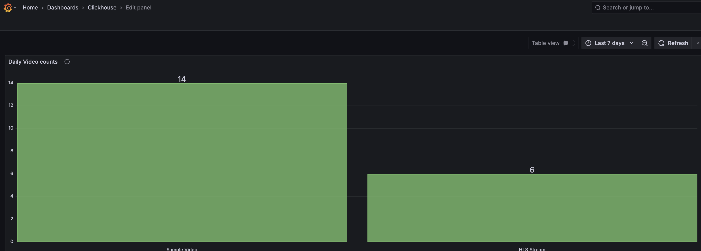
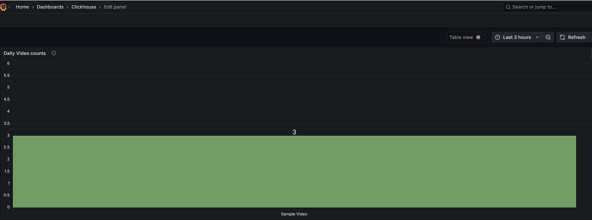

# Grafana and ClickHouse Integration & Dashboard Setup

This guide walks you through all the steps to:

- Install Grafana in Docker
- Install and configure the ClickHouse plugin
- Connect Grafana to your ClickHouse instance
- Build and save a series of panels for viewing session and event data

## 1. Prerequisites

- Install Docker and run it on the machine
- ClickHouse server running and accessible
- Basic familiarity with SQL and Grafana's UI

## 2. Install Grafana via Docker

Pull the official Grafana image and run it:

```bash
docker run -d \
  -p 3000:3000 \
  --name=grafana \
  grafana/grafana:latest
```

Wait a few seconds for startup, then open your browser at http://localhost:3000.

Log in with the default credentials:
- Username: admin
- Password: admin

You'll be prompted to set a new admin password now.

## 3. Install & Enable the ClickHouse Plugin

In the left-hand menu, click Settings (⚙️) → Plugins.

Search for ClickHouse and select ClickHouse.

Click Install, then Enable.

Restart Grafana if prompted:

```bash
docker restart grafana
```

## 4. Add ClickHouse as a Data Source

In Grafana's left menu, go to Configuration (⚙️) → Data Sources → Add data source.

Choose ClickHouse.

Fill in connection details:
url: https://eyevinnlab-epasdev.clickhouse-clickhouse.auto.prod.osaas.io/play
default_database: epas_default        
user:     ''           
password: '' 

Click Save & and one should see "Data source is working."

## 5. Build Dashboards & Panels

Create a new dashboard (+ → Dashboard), then add panels one by one. For each:

1. Click Add new panel
2. Select ClickHouse as the data source
3. Choose Query type: Time Series (or Table as noted)
4. Paste the SQL and hit Run Query
5. Adjust the visualization type (Time series, Bar gauge, Table, etc.)
6. Title your panel and click Apply

### 5.1. Event Frequencies per Hour/days/months, etc

```sql
SELECT
toStartOfHour(timestamp) AS time,
event,
count(*) AS count_of_events
FROM default.epas_default
WHERE timestamp BETWEEN $__from AND $__to
GROUP BY time, event
ORDER BY time ASC
```
Visualization: Bar chart or Pie chart

### 5.2. Distribution of Event Types

```sql
SELECT
event,
count(*) AS total_count
FROM default.epas_default
GROUP BY event
ORDER BY total_count DESC
```

Visualization: Bar chart or Pie chart


### 5.3. Top Videos (with Filtering)

```sql
SELECT
  JSONExtractString(payload, 'contentTitle') AS content_title,
  COUNT(*) AS play_count
FROM default.epas_default
WHERE
  event = 'metadata'
  AND JSONExtractString(payload, 'contentTitle') != ''
  AND NOT startsWith(JSONExtractString(payload, 'contentTitle'), 'Report: ["myTime"')
  AND $__timeFilter(timestamp)
GROUP BY content_title
ORDER BY play_count DESC
LIMIT 10

```






### 5.4. Playback Errors Over Time

```sql
SELECT
    toStartOfMinute(timestamp) AS time,
    JSONExtractString(payload, 'reason') AS reason,
    count(*) AS count_events
FROM epas_default
WHERE
    event = 'stopped'
    AND JSONExtractString(payload, 'reason') = 'error'
    AND $__timeFilter(timestamp)
GROUP BY time, reason
ORDER BY time ASC
```

Visualization: Table or Bar chart, time series, etc

```


## 6. Save and Share Your Dashboard

Click the save dashboard in the top-right.

Give it a name (e.g. ClickHouse Playback Metrics).

If desired, share the dashboard link or embed code via the Share button.

Now anyone with Grafana access can explore real‐time session & event data from ClickHouse.
